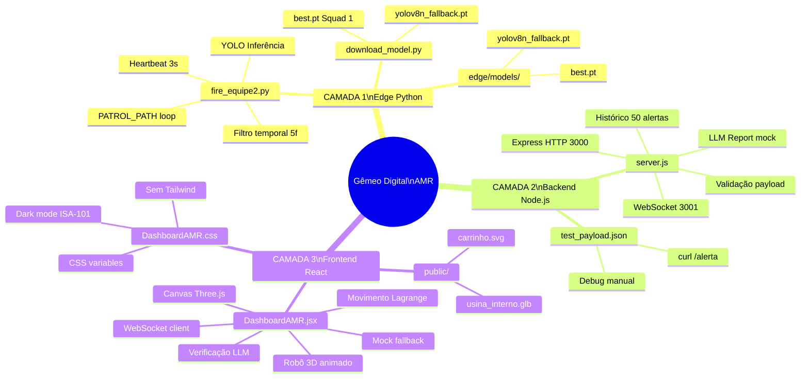
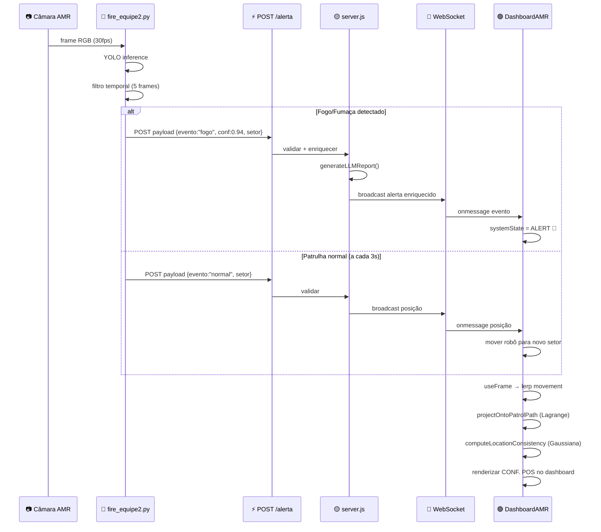
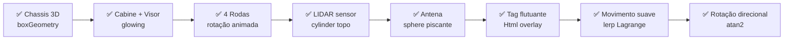

# 🏭 Estado Atual do Projeto — Gêmeo Digital AMR

> **Hackathon Ericsson | Mai 2026**
> Snapshot completo da arquitetura, tecnologias e funcionalidades implementadas

---

## 🗺️ Mapa Mental — Arquitetura do Sistema



---

## 📁 Estrutura de Pastas Atual

```
C:\GEMEODIGITAL\
│
├── 🔴 edge/                        CAMADA 1 — IA / Edge (Python)
│   ├── fire_equipe2.py             Inferência + heartbeat de patrulha
│   ├── download_model.py           Baixa best.pt ou cria fallback
│   ├── smoke-fire-detection-yolo-v12.ipynb   Notebook de treino
│   ├── requirements.txt
│   └── models/
│       ├── best.pt                 Modelo Squad 1 (fire/smoke)
│       └── yolov8n_fallback.pt     COCO genérico para demo
│
├── 🟡 backend/                     CAMADA 2 — Backend (Node.js)
│   ├── server.js                   Express HTTP(3000) + WS(3001)
│   └── test_payload.json           Payload de teste para debug
│
├── 🟢 frontend/                    CAMADA 3 — Gêmeo Digital (React)
│   ├── index.html                  Vite entry point
│   ├── vite.config.js
│   ├── public/
│   │   ├── usina_interno.glb       Modelo 3D da usina (planta real)
│   │   └── carrinho.svg            Ícone SVG do AMR (reserva)
│   └── src/
│       ├── main.jsx
│       └── components/
│           ├── DashboardAMR.jsx    Dashboard 3D/VR principal
│           └── DashboardAMR.css    Estilos dark mode
│
├── 📄 docs/
│   ├── README.md
│   ├── MATEMATICA.md               Fundamentos matemáticos
│   ├── ESTADO_ATUAL.md             Este arquivo
│   ├── O_QUE_FALTA.md              Roadmap por squad
│   ├── proposta de execução.pdf
│   └── Desafio-2-*.pdf
│
└── package.json                    Scripts: dev / server / start
```

---

## 🔄 Fluxo de Dados Completo



---

## 🛠️ Stack Tecnológica

### Frontend

| Tecnologia | Versão | Função |
|-----------|--------|--------|
| React | 19.2.5 | UI framework |
| Three.js | 0.184.0 | Motor 3D |
| @react-three/fiber | 9.6.1 | React → Three.js |
| @react-three/drei | 10.7.7 | Helpers 3D (Grid, Html, GLB) |
| @react-three/xr | 6.6.29 | WebXR / VR |
| Vite | 8.0.10 | Dev server + build |
| CSS puro | — | Sem Tailwind, classes semânticas |

### Backend

| Tecnologia | Versão | Função |
|-----------|--------|--------|
| Node.js | 18+ | Runtime |
| Express | 4.21.0 | API REST HTTP |
| ws | 8.18.0 | WebSocket server |
| cors | 2.8.5 | Cross-origin |
| concurrently | 9.1.0 | Rodar front+back juntos |

### Edge / IA

| Tecnologia | Versão | Função |
|-----------|--------|--------|
| Python | 3.10+ | Runtime |
| ultralytics | ≥8.3.0 | YOLOv8/v12 |
| opencv-python | ≥4.6.0 | Captura e visualização |
| requests | ≥2.28.0 | HTTP para o backend |

---

## ✅ Funcionalidades Implementadas

### Robô 3D — Dashboard



### Sistema de Alertas

| Funcionalidade | Estado |
|----------------|--------|
| Detecção YOLO fire/smoke | ✅ Implementado |
| Filtro temporal 5 frames | ✅ Implementado |
| Heartbeat de patrulha 3s | ✅ Implementado |
| POST /alerta validado | ✅ Implementado |
| WebSocket broadcast | ✅ Implementado |
| Reconexão automática WS | ✅ Implementado |
| Mock fallback sem backend | ✅ Implementado |
| Badge LIVE / DEMO | ✅ Implementado |
| Pulsação no alerta | ✅ Implementado |
| Header vermelho no alerta | ✅ Implementado |

### Localização Matemática

| Funcionalidade | Estado |
|----------------|--------|
| Projeção Lagrangiana no caminho | ✅ Implementado |
| Verificação LLM ↔ posição física | ✅ Implementado |
| Indicador de consistência (%) | ✅ Implementado |
| SECTOR_TO_3D mapping | ✅ Implementado |
| Waypoints de patrulha (4 setores) | ✅ Implementado |

### Gêmeo Digital 3D / VR

| Funcionalidade | Estado |
|----------------|--------|
| Planta usina_interno.glb | ✅ Carregando |
| Canvas Three.js full screen | ✅ Implementado |
| Iluminação ambiental + direcional | ✅ Implementado |
| Grid tático (corredores) | ✅ Implementado |
| OrbitControls (órbita livre) | ✅ Implementado |
| Câmara perspectiva 3/4 | ✅ Implementado |
| Botão ENTRAR VR (WebXR) | ✅ Implementado |

---

## 🔌 Contrato JSON — Padrão do Sistema

```json
{
  "id_alerta":   "ALRT-7823",
  "timestamp":   "2026-05-06T20:00:00Z",
  "evento":      "fogo | fumaca | normal",
  "confianca":   0.94,
  "localizacao_otimizada": {
    "x":     350,
    "y":     120,
    "setor": "Setor D - Caldeiras Químicas"
  },
  "llm_prompt":  "Texto gerado pelo LLM (mock ou real)",
  "llm_report":  "Relatório detalhado (enriquecido pelo backend)"
}
```

**Setores válidos:**
- `"Setor A - Turbinas"`
- `"Setor B - Geradores"`
- `"Setor C - Painéis de Controle"`
- `"Setor D - Caldeiras Químicas"`

---

## 🚀 Como Rodar Hoje

```bash
# 1. Instalar dependências Node
cd C:\GEMEODIGITAL
npm install

# 2. Instalar dependências Python
pip install -r edge/requirements.txt

# 3. Baixar modelo de IA
python edge/download_model.py

# 4. Iniciar tudo (backend + frontend simultâneos)
npm start

# → Frontend:  http://localhost:5173
# → Backend:   http://localhost:3000
# → WS:        ws://localhost:3001
# → Health:    http://localhost:3000/health

# 5. Testar o pipeline (sem câmara)
curl -X POST http://localhost:3000/alerta \
  -H "Content-Type: application/json" \
  -d @backend/test_payload.json

# 6. Iniciar inferência real (requer câmara ou vídeo)
python -m edge.fire_equipe2
```

---

## 🗂️ Endpoints da API

| Método | Endpoint | Descrição |
|--------|---------|-----------|
| POST | `/alerta` | Recebe telemetria do edge Python |
| GET | `/alertas` | Lista histórico (últimos 50) |
| GET | `/health` | Health check + contagem clientes WS |

---

> **Arquivo:** `docs/ESTADO_ATUAL.md` | **Projeto:** Gêmeo Digital AMR | **Data:** Mai 2026
