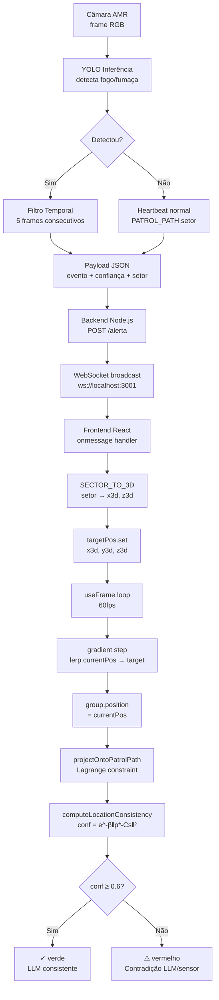

# 📐 Fundamentos Matemáticos — Localização do AMR

> **Gêmeo Digital de Segurança | Hackathon Ericsson**
> Modelos de otimização para posicionamento e verificação de consistência do robô AMR

---

## 🗺️ Mapa Mental — Visão Geral

```mermaid
mindmap
  root((Localização AMR))
    Trilateration
      Função de custo J
      Gradiente ∇J
      Descida do Gradiente
      Âncoras de referência
    Lagrange
      Restrição de caminho g(x,z)=0
      Projeção ortogonal
      Solução fechada t*
      Segmentos de patrulha
    Consistência LLM
      Gaussiana de confiança
      β controla largura
      Limiar 0.6
      Contradição detectável
    Movimento Suave
      lerp = gradient step
      Velocidade 2 m/s
      Rotação atan2
      Rodas animadas
```

---

## 1. O Problema de Localização

O sistema opera em **dois espaços de coordenadas** que precisam ser reconciliados:

| Espaço | Sistema | Unidade | Origem |
|--------|---------|---------|--------|
| Câmara do AMR | Python / YOLO | pixels (px) | canto superior esquerdo |
| Gêmeo Digital 3D | Three.js / GLB | metros (m) | centro da usina |
| Setor linguístico | LLM / backend | texto | — |

O objetivo é garantir que quando a LLM diz **"Setor D - Caldeiras"**, o ponto 3D correspondente no gêmeo digital seja realmente aquele local na planta.

---

## 2. Trilateration por Descida do Gradiente

### Contexto

Com sensores LIDAR reais, o AMR mede distâncias $r_i$ a pontos âncora $A_i$ conhecidos (pilares, paredes). A posição $(x, z)$ é encontrada minimizando o erro quadrático:

$$J(x, z) = \sum_{i=1}^{n} \Bigl( d_i(x,z) - r_i \Bigr)^2$$

onde:

$$d_i(x,z) = \sqrt{(x - a_i^x)^2 + (z - a_i^z)^2}$$

### Gradiente

$$\frac{\partial J}{\partial x} = 2\sum_{i=1}^{n} \bigl(d_i - r_i\bigr) \cdot \frac{x - a_i^x}{d_i}$$

$$\frac{\partial J}{\partial z} = 2\sum_{i=1}^{n} \bigl(d_i - r_i\bigr) \cdot \frac{z - a_i^z}{d_i}$$

### Update — Descida do Gradiente

$$\begin{pmatrix} x \\ z \end{pmatrix}^{(t+1)} = \begin{pmatrix} x \\ z \end{pmatrix}^{(t)} - \alpha \begin{pmatrix} \partial J/\partial x \\ \partial J/\partial z \end{pmatrix}$$

com taxa de aprendizado $\alpha$ (step adaptativo para não divergir).

### Relação com o `lerp` no Three.js

O movimento suave implementado no `useFrame` é **matematicamente equivalente** a um passo de gradient descent na função de custo de posição:

$$f(p) = \| p - p_{\text{target}} \|^2 \implies \nabla f = 2(p - p_{\text{target}})$$

O update `lerp(p, target, step/dist)` produz exatamente:

$$p^{(t+1)} = p^{(t)} + \text{speed} \cdot \Delta t \cdot \frac{p_{\text{target}} - p^{(t)}}{\| p_{\text{target}} - p^{(t)} \|}$$

que é gradient descent com normalização (step fixo em módulo, sem overshoot).

---

## 3. Lagrange — Restrição de Caminho

### O Problema

O AMR **não pode atravessar paredes**. Portanto, quando estimamos a posição, precisamos que ela **pertença ao corredor de patrulha**. Isso é uma restrição de igualdade:

$$\underset{x,z}{\min}\ J(x,z) \quad \text{s.a.} \quad g(x,z) = 0$$

### Restrição do Segmento de Patrulha

Para o segmento $W_k \to W_{k+1}$ (waypoints consecutivos), a restrição é:

$$g(x, z) = (z - W_k^z)(W_{k+1}^x - W_k^x) - (x - W_k^x)(W_{k+1}^z - W_k^z) = 0$$

### Lagrangiano

$$\mathcal{L}(x, z, \lambda) = J(x, z) + \lambda \cdot g(x, z)$$

$$\nabla_{x,z,\lambda}\ \mathcal{L} = \mathbf{0}$$

### Solução Fechada — Projeção Ortogonal

Para $J(x,z) = \|p - \hat{p}\|^2$ (distância ao ponto estimado), o mínimo restrito tem solução analítica exata:

$$\boxed{t^* = \text{clamp}\!\left(\frac{(\hat{p} - W_k) \cdot (W_{k+1} - W_k)}{\|W_{k+1} - W_k\|^2},\ 0,\ 1\right)}$$

$$\boxed{p^*_{\text{path}} = W_k + t^* \cdot (W_{k+1} - W_k)}$$

O parâmetro $t^* \in [0,1]$ indica a posição relativa no segmento:
- $t^* = 0$ → o ponto projetado é o próprio $W_k$
- $t^* = 1$ → o ponto projetado é $W_{k+1}$
- $t^* = 0.5$ → meio do segmento

### Algoritmo para todos os segmentos

```
Para cada segmento k de 0 a N-1:
  1. Calcule t* pela fórmula acima
  2. Calcule o ponto projetado p*_k
  3. Calcule dist_k = ||p - p*_k||

Selecione o segmento com menor dist_k → p*_path
```

Implementado em `projectOntoPatrolPath()` no `DashboardAMR.jsx`.

---

## 4. Verificação de Consistência LLM ↔ Posição Física

### O Problema

A LLM classifica o setor linguisticamente (`"Setor D"`). Mas o sensor físico diz que o robô está em coordenadas $(x, z)$. Como saber se há contradição?

### Função de Confiança (Gaussiana)

Define-se $C_s$ como o centro 3D do setor $s$. A confiança de que a posição projetada $p^*$ pertence ao setor declarado é:

$$\text{conf}(p^*, s) = e^{-\beta \cdot \|p^* - C_s\|^2}$$

onde:
- $\beta = 0.18$ controla a "largura" da gaussiana (quão longe é tolerado)
- $\text{conf} = 1$ → o robô está exatamente no centro do setor declarado
- $\text{conf} \to 0$ → o robô está longe do setor declarado

### Tabela de Interpretação

| conf | Significado | Cor no Dashboard |
|------|-------------|-----------------|
| ≥ 0.8 | Totalmente consistente | Verde |
| 0.6 – 0.8 | Dentro da margem do setor | Verde |
| 0.4 – 0.6 | Região de transição entre setores | Amarelo |
| < 0.4 | Contradição — LLM e sensor divergem | Vermelho ⚠ |

### Exemplo Numérico

Setor D declarado, $C_D = (4, 0.5, 3)$, $\beta = 0.18$:

| Posição do robô $(x,z)$ | $\|p^* - C_D\|^2$ | conf |
|--------------------------|-------------------|------|
| $(4.0,\ 3.0)$ — no centro | $0.0$ | $1.00$ |
| $(3.0,\ 2.5)$ — próximo | $1.25$ | $0.80$ |
| $(0.0,\ 0.0)$ — corredor | $25.0$ | $0.01$ |
| $(-4.0,\ -3.0)$ — Setor A | $98.0$ | $\approx 0$ |

---

## 5. Diagrama Completo do Fluxo Matemático



---

## 6. Parâmetros do Sistema

| Parâmetro | Valor | Significado |
|-----------|-------|-------------|
| `SPEED` | 2.0 m/s | Velocidade de movimento suave no Three.js |
| `BETA` | 0.18 | Largura da gaussiana de consistência |
| `CONF_THRESHOLD` | 0.6 | Limiar de detecção de contradição |
| `CONFIRMATION_FRAMES` | 5 | Frames YOLO para validar alerta |
| `CONFIDENCE_THRESHOLD` | 0.5 | Confiança mínima YOLO por detecção |
| `HEARTBEAT_INTERVAL` | 3.0 s | Frequência de update de patrulha normal |

---

## 7. Extensões Futuras

### Kalman Filter (fusão de sensores)

Para produção real, o Lagrange + gradiente pode ser substituído por um **Extended Kalman Filter (EKF)** que funde:
- Odometria das rodas (predição)
- LIDAR/triangulação (correção)
- GPS indoor (UWB/Wi-Fi RSSI)

$$\hat{x}_k = F\hat{x}_{k-1} + Bu_k \quad \text{(predição)}$$
$$\hat{x}_k = \hat{x}_k + K_k(z_k - H\hat{x}_k) \quad \text{(correção)}$$

### Graph SLAM

Para mapeamento simultâneo da planta (se o GLB não estiver disponível), usa-se SLAM baseado em grafo com otimização por **método de Gauss-Newton** (generalização do gradiente de segunda ordem).

---

> **Arquivo:** `docs/MATEMATICA.md` | **Projeto:** Gêmeo Digital AMR | **Data:** Mai 2026
